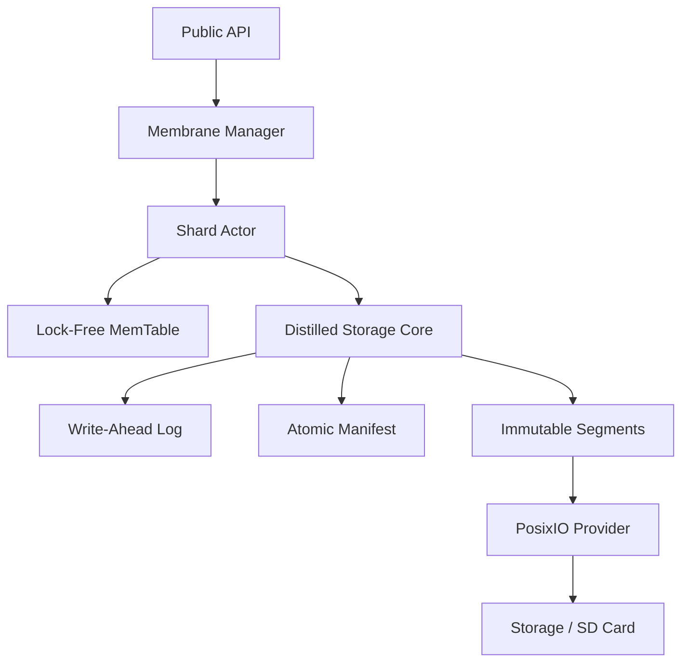

# 🧶 PomaiDB — The Lean & Mean Edge Vector Database

[](https://en.cppreference.com/w/cpp/20)
[](https://opensource.org/licenses/Apache-2.0)
[]()
[](https://github.com/AutoCookies/pomaidb)

**PomaiDB** is a high-performance, embedded vector database distilled for the era of **Edge AI**. Re-engineered in pure C++20, it strips away the bloat of legacy storage engines to deliver a "lean and mean" experience on Raspberry Pi 5, Android, and other edge hardware.

> *"A database should be like a Pomegranate: Atomic grains of data, protected by an immutable membrane."*

---

## 🔥 The "Distilled" Edge
PomaiDB v1.4.0 marks a major architectural milestone. We've replaced heavy third-party storage dependencies with a native, zero-copy core that prioritizes **minimal SD card wear** and **extreme predictability**.

- **Zero-Copy Anatomy**: Pure `std::span` and `PinnableSlice` paths from disk to your search results. No unnecessary copies, even for quantized data.
- **Leveled Compaction Lite**: A specialized LSM-tree implementation designed to minimize write amplification (WAF), protecting your edge hardware storage units.
- **Embedded Actor Model**: Sharded architecture with lock-free reads and deterministic freeze semantics.
- **ARM64 Native**: Hand-tuned for NEON/SIMD, providing ultra-fast brute-force search where indices might be too heavy.

---

## 🏗️ Architecture at a Glance



---

## ⚡ Quick Start

```cpp
#include <pomai/pomai.h>
#include <iostream>

int main() {
    // 1. Configure for the Edge
    pomai::DBOptions opt;
    opt.path = "./vault.pdb";
    opt.dim = 384;
    opt.shard_count = 4; // Optimized for your CPU cores

    // 2. Open the Vault
    std::unique_ptr<pomai::DB> db;
    auto st = pomai::DB::Open(opt, &db);
    if (!st.ok()) return 1;

    // 3. Zero-Copy Ingestion
    std::vector<float> vec(384, 0.5f);
    db->Put(42, vec);

    // 4. Freeze to Publish (Snapshot Visibility)
    db->Freeze("__default__");

    // 5. Blazing Fast Search
    pomai::SearchResult res;
    db->Search(vec, 5, &res);

    for (auto& hit : res.hits) {
        std::cout << "ID: " << hit.id << " Score: " << hit.score << "\n";
    }

    return 0;
}
```

---

## 💎 Features for the Elite
- **Pure C++20**: Zero-dependency storage core (excluding FAISS for graph indexing).
- **Deterministic Visibility**: Readers see a perfectly consistent view thanks to atomic snapshots.
- **Power-Loss Resilient**: WAL + atomic manifest updates ensure your data survives sudden crashes.
- **Hybrid RAG Support**: Dedicated `RAG` membranes for combined lexical and vector search.
- **Compact & Portable**: Static binary links in seconds, with a tiny runtime footprint.

---

## 📊 Performance Baseline (100k Vectors, 128 Dim)

| Task | Throughput / Latency |
|------|----------------------|
| **Ingestion** | > 15,000 vectors/sec |
| **Search (HNSW)** | < 1ms Latency @ 99.1% Recall |
| **Recovery** | Atomic manifest rollback in < 10ms |

---

## 🛠️ Build for Growth

```bash
git clone https://github.com/AutoCookies/pomaidb
cd pomaidb && mkdir build && cd build
cmake .. -DCMAKE_BUILD_TYPE=Release
cmake --build . -j$(nproc)
```

- **Verify Your Build**: `ctest`
- **Inspect Your Data**: `./bin/pomai_inspect`

---

<p align="center">
  Made with ❤️ for <b>local, private, and fast</b> AI builders. <br/>
  <b>Star ⭐ this repo if you're building the future of Edge AI!</b>
</p>