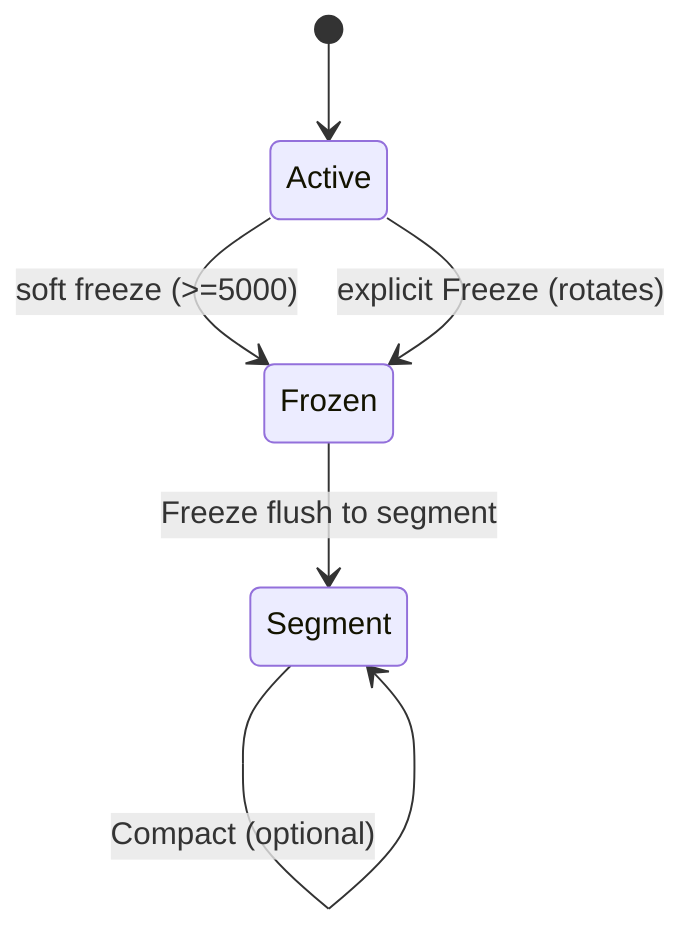
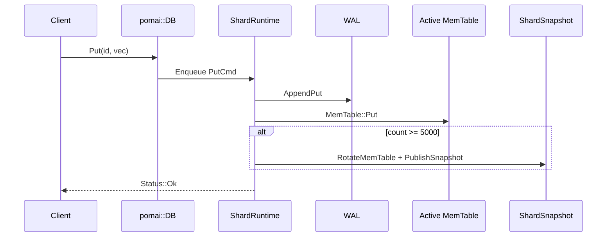
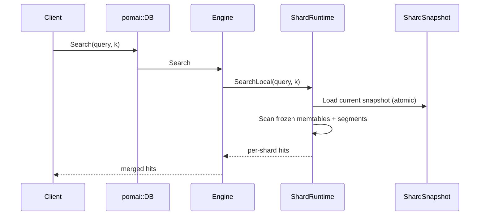

# Architecture

## What it is
- An embedded, single-process storage engine with **sharded single-writer** runtimes and **lock-free snapshot readers**. (Source: `pomai::core::Engine`, `pomai::core::ShardRuntime`.)

## What it is not
- Not distributed or replicated. (Assumption based on absence of network stack and on-disk layout.)

## Design goals
- Serialize writes per shard via a single writer thread. (Source: `pomai::core::ShardRuntime::RunLoop`.)
- Allow concurrent, lock-free reads from immutable snapshots. (Source: `pomai::core::ShardRuntime::Get`, `Search`, `ShardSnapshot`.)
- Provide crash recovery via WAL replay. (Source: `pomai::storage::Wal::ReplayInto`.)

## Non-goals
- Multi-tenant isolation, replication, or cluster management. (Assumption based on code scope.)

## Component diagram
```mermaid
flowchart TB
  API[Public API: pomai::DB] --> MM[MembraneManager]
  MM --> ENG[Engine (per membrane)]
  ENG --> SHARD[Shard (per shard)]
  SHARD --> RT[ShardRuntime]
  RT --> WAL[WAL per shard]
  RT --> MEM[Active MemTable]
  RT --> FMEM[Frozen MemTables]
  RT --> SEG[Segments]
  SEG --> MAN[Shard Manifest]
  ENG --> POOL[Search Thread Pool]
```

## Key invariants
- Snapshots are immutable after publication. (Source: `core/shard/invariants.h`.)
- Snapshots represent a prefix of WAL history. (Source: `core/shard/invariants.h`.)
- Readers use a single snapshot per operation. (Source: `ShardRuntime::Get`, `Search`, `core/shard/invariants.h`.)

## Data path
- **Write path**: API → shard mailbox → WAL append → Active MemTable → optional soft freeze → snapshot publish. (Source: `ShardRuntime::Put`, `HandlePut`, `RotateMemTable`, `PublishSnapshot`.)
- **Read path**: API → snapshot load → frozen memtables → segments → merge. (Source: `ShardRuntime::GetFromSnapshot`, `SearchLocalInternal`.)
- **Persistence path**: `Freeze` flushes frozen memtables to segments, updates shard manifest, resets WAL. (Source: `ShardRuntime::HandleFreeze`.)

## Read path
1. `ShardRuntime::Get`/`Search` loads `current_snapshot_` atomically. (Source: `ShardRuntime::GetSnapshot`, `ShardRuntime::Get`, `ShardRuntime::Search`.)
2. Frozen MemTables are scanned in newest-to-oldest order. (Source: `ShardRuntime::GetFromSnapshot`.)
3. Segments are scanned in newest-to-oldest order. (Source: `ShardRuntime::GetFromSnapshot`, `SegmentReader::Find`.)

## Write path
1. Client call enqueues a write into a bounded mailbox. (Source: `ShardRuntime::Enqueue`, `BoundedMpscQueue`.)
2. The writer thread appends the record to WAL. (Source: `ShardRuntime::HandlePut`, `Wal::AppendPut`.)
3. The writer thread updates the active MemTable. (Source: `ShardRuntime::HandlePut`, `MemTable::Put`.)
4. When active count ≥ 5000, a soft freeze rotates MemTable to frozen and publishes a snapshot. (Source: `ShardRuntime::HandlePut`, `RotateMemTable`, `PublishSnapshot`.)

## State machine


## Failure semantics
- See [docs/FAILURE_SEMANTICS.md](FAILURE_SEMANTICS.md) for crash-by-crash outcomes.

## Operational notes
- There is no background flush thread; `Freeze` must be called explicitly to persist frozen tables to segments. (Source: `ShardRuntime::HandleFreeze`.)
- Search is brute-force over snapshot data today. (Source: `ShardRuntime::SearchLocalInternal`.)

## Metrics
- No built-in metrics are exported in the current code. (Source: absence of metric interfaces in `pomai::DB` and `pomai::core::Engine`.)

## Limits
- Snapshot staleness is bounded by active MemTable size (fixed at 5000 items per shard). (Source: `ShardRuntime::HandlePut`.)
- Metric selection in `MembraneSpec` is not wired into search scoring. (Source: `ShardRuntime::SearchLocalInternal`, `core/distance.h`.)

## Request lifecycle (Upsert)


## Request lifecycle (Search)


## Code pointers (source of truth)
- `pomai::core::ShardRuntime::RunLoop` — single-writer actor loop. (File: `src/core/shard/runtime.cc`.)
- `pomai::core::ShardRuntime::HandlePut` — WAL append + MemTable update + soft freeze trigger. (File: `src/core/shard/runtime.cc`.)
- `pomai::core::ShardRuntime::PublishSnapshot` — snapshot publication. (File: `src/core/shard/runtime.cc`.)
- `pomai::core::ShardRuntime::SearchLocalInternal` — snapshot-based brute-force search. (File: `src/core/shard/runtime.cc`.)
- `pomai::core::ShardManifest::Commit` — manifest atomic update + dir fsync. (File: `src/core/shard/manifest.cc`.)
- `pomai::storage::Wal::ReplayInto` — crash recovery replay. (File: `src/storage/wal/wal.cc`.)
