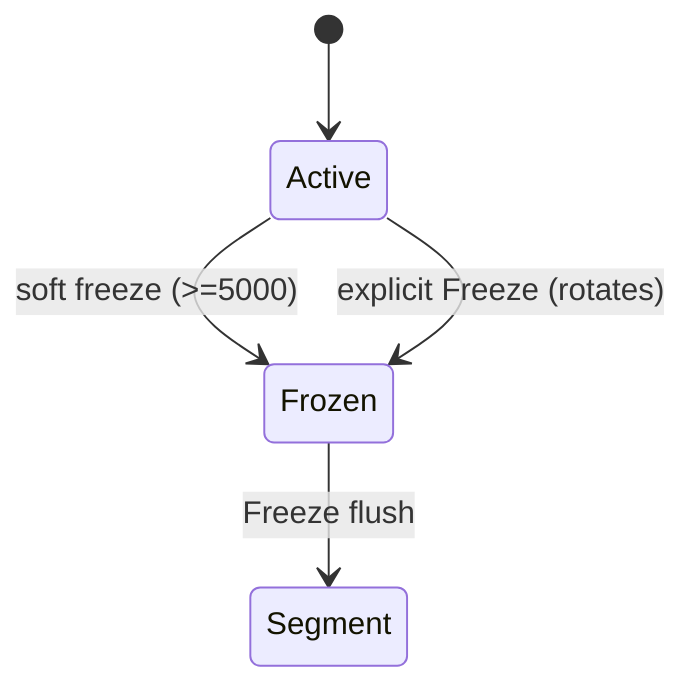

# Consistency model

## What it is
- **Snapshot Isolation per shard**: Reads (`Get`, `Exists`, `Search`) operate on a single immutable `ShardSnapshot` taken at read time. (Source: `pomai::core::ShardRuntime::Get`, `Search`, `ShardSnapshot`.)
- **Bounded staleness**: Writes are visible only after the active MemTable is rotated (soft freeze) or after explicit `Freeze`. (Source: `pomai::core::ShardRuntime::HandlePut`, `RotateMemTable`, `HandleFreeze`.)

## What it is not
- Not linearizable and not read-your-writes by default. (Source: `core/shard/invariants.h` and snapshot exclusion of active MemTable.)

## Design goals
- Provide lock-free readers that never block on writers. (Source: `ShardRuntime::GetSnapshot` + snapshot-only read path.)
- Preserve per-shard write ordering via a single writer thread. (Source: `ShardRuntime::RunLoop`.)

## Non-goals
- Global ordering across shards. (Assumption based on per-shard ownership and absence of cross-shard coordination.)

## Key invariants
- Snapshots are immutable after publication. (Source: `core/shard/invariants.h`.)
- Snapshot versions are monotonically increasing. (Source: `ShardRuntime::PublishSnapshot`.)
- Deletes become visible only after soft freeze. (Source: `core/shard/invariants.h`, `ShardRuntime::HandleDel`.)

## Read path
- Reads load the latest `ShardSnapshot` and query only frozen tables and segments. (Source: `ShardRuntime::Get`, `GetFromSnapshot`, `SearchLocalInternal`.)

## Write path
- Writes append to WAL, update the active MemTable, and may trigger a soft freeze when count ≥ 5000. (Source: `ShardRuntime::HandlePut`.)

## State machine


## Consistency definition (formal)
- Let `S_t` be the snapshot published at time `t`. A read at time `t` returns results from `S_t` only. (Source: `ShardRuntime::GetSnapshot`.)
- `S_t` contains all operations that were processed before the most recent soft freeze prior to `t`. (Source: `core/shard/invariants.h`, `ShardRuntime::RotateMemTable`.)
- The active MemTable is excluded from `S_t`, so writes after the last freeze are invisible. (Source: `ShardRuntime::PublishSnapshot`.)

## Bounded staleness
- **Bound**: By default, at most **5000 writes per shard** can be invisible at any time (the active MemTable threshold). (Source: `ShardRuntime::HandlePut`.)
- **Units**: Count of entries in the active MemTable, not time or bytes. (Source: `MemTable::GetCount` usage in `ShardRuntime::HandlePut`.)
- **Configurability**: Not configurable in current code. (Assumption based on hard-coded constant.)

## Read-your-writes (RYW)
- RYW is **not supported** until a soft freeze or explicit `Freeze` publishes a new snapshot. (Source: `core/shard/invariants.h` + snapshot exclusion of active MemTable.)
- To obtain RYW, call `Freeze` and then perform reads. (Source: `ShardRuntime::HandleFreeze` publishes snapshot.)

## Ordering guarantees
- **Per-shard**: Writes are applied in mailbox order, and snapshots advance monotonically. (Source: `ShardRuntime::RunLoop`, `PublishSnapshot`.)
- **Cross-shard**: No ordering or transactional guarantees across shards. (Assumption based on lack of coordination in `Engine::Put`.)

## Timeline examples

### Example 1: Write visibility after soft freeze
```
T0: Put(id=1) -> appended to WAL + Active MemTable
T1: Get(id=1) -> NotFound (active not in snapshot)
T2: Active count reaches 5000 -> RotateMemTable + PublishSnapshot
T3: Get(id=1) -> Found (visible in snapshot)
```
- Behavior: T1 is allowed to miss the write due to snapshot isolation. (Source: `ShardRuntime::GetFromSnapshot` + `RotateMemTable`.)

### Example 2: Explicit Freeze
```
T0: Put(id=2)
T1: Freeze() -> rotates active, flushes to segment, publishes snapshot
T2: Search() -> includes id=2
```
- Behavior: Freeze publishes a snapshot after segment creation. (Source: `ShardRuntime::HandleFreeze`.)

## Failure semantics
- See [docs/FAILURE_SEMANTICS.md](FAILURE_SEMANTICS.md) for crash-by-crash outcomes.

## Operational notes
- Use `Flush` to make WAL durable if `fsync` is enabled. (Source: `Wal::Flush`.)
- Use `Freeze` to make data visible and persisted to segments. (Source: `ShardRuntime::HandleFreeze`.)

## Metrics
- No built-in metrics for snapshot lag or visibility delays. (Source: public API lacks metric endpoints.)

## Limits
- Snapshot staleness bound is fixed at 5000 entries per shard. (Source: `ShardRuntime::HandlePut`.)

## Code pointers (source of truth)
- `pomai::core::ShardRuntime::GetSnapshot` — snapshot acquisition for reads. (File: `src/core/shard/runtime.h`.)
- `pomai::core::ShardRuntime::HandlePut` — WAL append + MemTable update + soft freeze threshold. (File: `src/core/shard/runtime.cc`.)
- `pomai::core::ShardRuntime::RotateMemTable` — active → frozen rotation + snapshot publication. (File: `src/core/shard/runtime.cc`.)
- `pomai::core::ShardRuntime::HandleFreeze` — hard freeze flush to segments + WAL reset. (File: `src/core/shard/runtime.cc`.)
- `pomai::core::ShardRuntime::PublishSnapshot` — snapshot version monotonicity. (File: `src/core/shard/runtime.cc`.)
- `pomai::core::invariants` — explicit snapshot invariants. (File: `src/core/shard/invariants.h`.)
